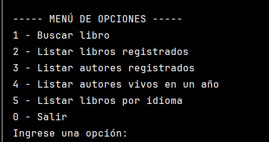

# 📚 Challenge Literatura

Esta aplicación permite buscar libros y autores usando una API externa (Gutendex) y guardar los resultados en una base de datos.

## 🚀 Funcionalidades

✅ Buscar libros por título  
✅ Listar todos los libros registrados en base de datos  
✅ Listar todos los autores registrados  
✅ Listar autores vivos en un año específico  
✅ Listar libros según su idioma  
✅ Guardado automático de autores y libros evitando duplicados

## 🧭 Menú principal

El menú muestra las opciones disponibles para que el usuario interactúe con la aplicación.

## 🔎 Resultado de búsqueda de libros

Se muestra el título, autor, idioma y número de descargas. Los resultados también se guardan en la base de datos.

## 🧠 Filtro de autores vivos

Permite ver los autores registrados que estaban vivos en un año que el usuario indique.

## 🌐 Filtrado por idioma

Muestra una lista de libros según el idioma seleccionado, utilizando los códigos como `en`, `es`, `fr`, etc.

## 🛑 Finalización del programa

Al seleccionar la opción "Salir", el programa se cierra de forma segura.

## 🎥 Video demostrativo

> Puedes agregar una imagen o enlace aquí con el video de demostración:  
> 📽️ [Ver demo](https://tulink.com)

## 🛠️ Tecnologías usadas

- Java 17
- Spring Boot
- API REST Gutendex (https://gutendex.com)
- JPA + H2 (base de datos en memoria)
- Maven

## ℹ️ Acerca del proyecto

Este proyecto fue desarrollado como parte de un desafío de programación para practicar consumo de APIs, persistencia con JPA y estructura de aplicaciones Java.